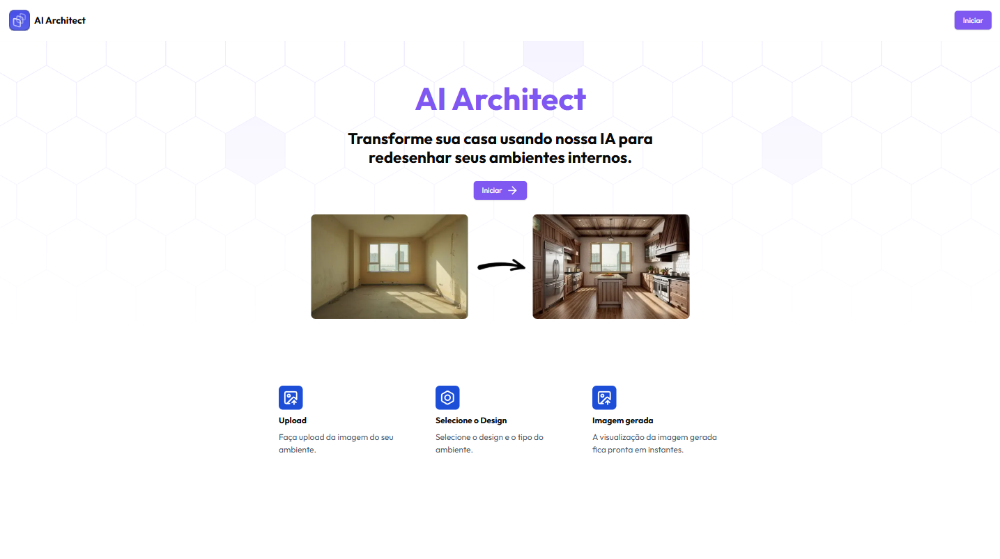
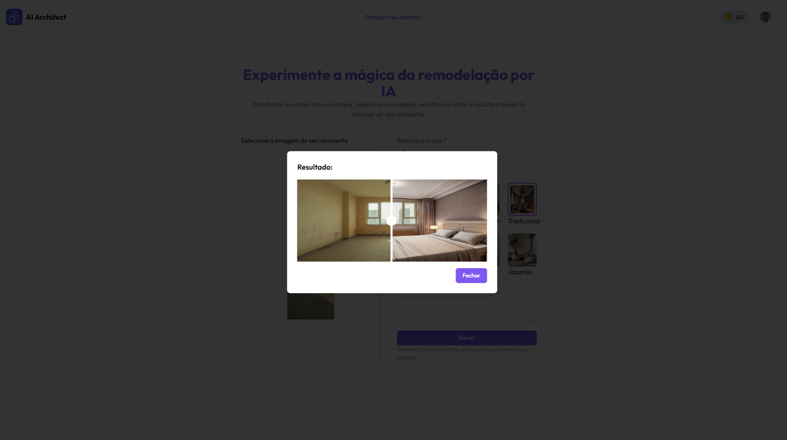
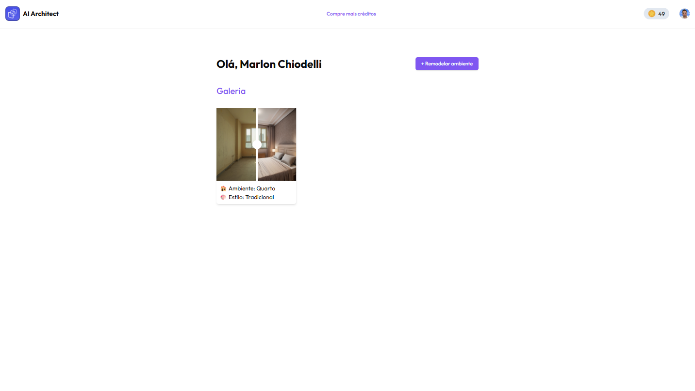

# AI Architect

Aplicação SaaS onde o usuário faz o upload de um ambiente de sua casa e a IA gera uma nova imagem customizando o ambiente conforme as opções selecionadas pelo usuário.

## Live

Acesse <https://ai-architect-bret7a94l-marlonchis-projects.vercel.app/> para visualizar a aplicação.

## Tech Stack
- React/Nextjs
- tailwind
- shadcn/ui
- clerk
- neon database
- paypal
- axios
- drizzle orm
- firebase
- replicate
- react-before-after-slider-component

## Screenshots

  

  

  

